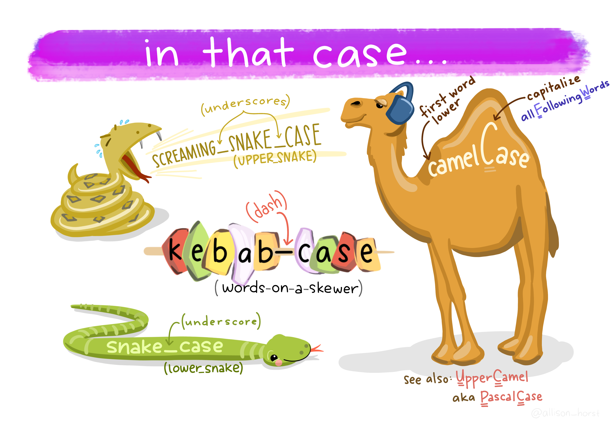

# Introduction

This HTML notebook will replicate the STATA do file named __vnm_mics14_dp2019 for distribution__ in R. The goal is to create an R script that does what the said do file does.

I will follow the same section numbering as in the do file for ease of comparision.

# Libraries

Before we go into the excercise, following are the packages from which we will use various functions.

```{r Libraries}
library(here)
library(tidyverse)
library(janitor)
library(haven)
library(gt)
library(readr)
library(magrittr)
```

# Building a Well-Being Index from Vietnam MICS 2013-14

The memory and environment clearing commands and the commands for setting working folders and paths are not needed if one is working in Project mode through RStudio and uses the {here} (read as package here). This is a library for managing paths and directories.

# Vietnam MICS 2014

## Step 1: Data Preparation

__ Selecting main variables from CH, WM, HH & MN recode & merging with HL recode __

It should be noted that anthropometric data was not collected for children under 5 as part of the Viet Nam MICS 2014 dataset. Previously, nutrition data was collected as part of Viet Nam MICS 2011. However, the data was not collected in this round due to time and resource constraints as well as the availability of national nutrition survey data (p.61)

_Above comments are copied from the STATA do file_

### Step 1.1: CH - Children's Recode (Under 5)

According to the STATA do file there is no data for this section.

### Step 1.2: BH - Birth Recode (All females 15-49 years who ever gave birth)

The purpose of step 1.2 is to identify children of any age who died in the last 5 years prior to the survey date. _As seen in the STATA file_

Loading the data from bh.sav.

```{r load_bh}
bh_dat <- read_sav(file = here("Viet Nam_MICS5_Datasets",
                     "Viet Nam MICS 2013-14 SPSS Datasets",
                     "bh.sav"))

bh_dat <- clean_names(bh_dat)
```

The above code chunk loads the bh.sav and names it bh_dat(a data object). The clean names function gets all the variable names in lower snake case. IN case if anyone is wondering what are all the possible cases, please refere to the wonderful art by Allison Horst shown below.



Now let us take a glimplse at the data and names of the variables.

```{r varnames}
names(bh_dat)
```

```{r peek}
head(bh_dat) %>% gt()
```

Now let us create variables, only those that are non grouped, i.e. those generated without using _bysort_. In R one can create grouped varibales in a different manner. Will show that in the code chunk following this one.

Before moving forward, please note that, a large part of coding involved in creating this index is a data wrangling process. The tidyverse way of carrying out data wrangling extensively employs {dplyr} (read as 'package dplyr') and its mutate function. Here is a visual cue (created by Allison Horst) to what the mutate function does.


```{r bh_newvars}
bh_dat <- bh_dat %>% 
  mutate(
    ind_id = structure(((hh1*100000)+(hh2*100)+ln),
                       label = "Individual ID"),
    date_death = structure(bh4c + bh9c, 
                           label = "Date of Death CMC"),
    mdead_survey = structure(ifelse(((bh9c == 0 |is.na(bh9c)) & bh5 == 1),
                                     NA, 
                                     wdoi - date_death), 
                             label = "Months Dead from Survey"),
    ydead_survey = structure(mdead_survey/12, 
                             label = "Years dead from Survey"),
    age_death = structure(ifelse(bh5 == 2, bh9c, NA),
                          label = "Age at death in Months"),
    child_died = structure(forcats::as_factor(
      ifelse(is.na(bh5),NA,
             ifelse(bh5==1,"child is alive","child is dead")))),
    child18_died = forcats::as_factor(
      ifelse((!is.na(age_death) & age_death > 216),
             ifelse(is.na(bh5),NA,
                    ifelse(bh5==1,
                           "child is alive",
                           "child is dead")), 
             "child is alive"))
    )
```

Creating Tables for new variables check.

```{r table age_death}
bh_dat %>% 
  tabyl(age_death,show_na = TRUE) %>% 
  gt()
```


```{r bh5 child_died}
bh_dat %>% 
  tabyl(bh5, child_died, show_na = T) %>% 
  gt()
```

```{r tab child18_died}
bh_dat %>% 
  tabyl(child18_died, show_na = T) %>% 
  gt()
```

Creating grouped variables.

Notice that I need not write equivalent R code for the following STATA code chunks:


1> _This has been included in the grouped condition for the variable_

replace tot_child18_died_5y=. if child18_died==1 & ydead_survey==. //Replace as '.' if there is no information on when the child died  

2> _This need not be written as the structure of data is different, only one rwo exists per ind_id_ __NOte that due to this feature there is no need to create "child18u_died_per_wom_5y" as it is same as "tot_child18_died_5y"__

bysort ind_id: egen childu18_died_per_wom_5y = max(tot_child18_died_5y) 
lab var childu18_died_per_wom_5y "Total child under 18 death for each women in the last 5 years (birth recode)"

3> _This need not be written as the structure of data is different, only one rwo exists per ind_id_

//Keep one observation per women 
bysort ind_id: gen id=1 if _n==1 keep if id==1 drop id duplicates report ind_id

```{r bh_newvars_grouped}
bh_dat %>% 
  group_by(ind_id) %>% 
  summarise(
    tot_child_died = sum(child_died == "child is dead", na.rm = T),
    tot_child18_died_5y = sum(
      child18_died[ydead_survey <= 5 & !is.na(ydead_survey)] == "child is dead", na.rm = T),
    women_BH = 1
) %>% 
  mutate(
    tot_child18_died_5y = ifelse(
      (is.na(tot_child18_died_5y) & tot_child_died>=0 & !is.na(tot_child_died)),0,tot_child18_died_5y)
  )-> grouped_bh_dat
```


Creating variables for new grouped variables

```{r tot_child_died tot_chil18_died_5y}
grouped_bh_dat %>% 
  tabyl(tot_child_died, tot_child18_died_5y, show_na = T)
```

Writing new files.

```{r write}
write_csv(bh_dat, here("output data files","1.2Intermediate_VNM14_BH.csv"))
write_csv(grouped_bh_dat,here("output data files","1.2VNM14_BH.csv")) # same as VNM14_BH.dta
```

### Step 1.3: WM - Women's Record (All eligible females 15-49 in the household)

Loading data and setting case for variable (column) names.

```{r load_wm}
wm_dat <- read_sav(file = here("Viet Nam_MICS5_Datasets",
                     "Viet Nam MICS 2013-14 SPSS Datasets",
                     "wm.sav"))

wm_dat <- clean_names(wm_dat)
```

Mutating the data for creating new variables. This is what one would refere to generating new varibles in STATA, I think.

Note, for the varible marital or marital_wom, I miss to see whyn the STATA code defines it as marital to begin with and renames it to marital_wom. I will define this varibale as marital_wom from the begining itself. Kindly bring to notice if this is incorrect.

```{r wm_newvar}
wm_dat <- wm_dat %>% 
  mutate(
    ind_id = structure(((hh1*100000)+(hh2*100)+ln),
                       label = "Individual ID"),
    women_wm = 1,
    marital_wom = structure(
      forcats::as_factor(
      case_when(
        mstatus == 3 & is.na(ma6) ~ "Never Married",
        mstatus == 1 & is.na(ma6) ~ "Currently Married",
        mstatus == 2 & ma6 == 1 ~ "Widowed",
        mstatus == 2 & ma6 == 2 ~ "Divorced",
        mstatus == 2 & ma6 == 3 ~ "Seperated/Not living together",
      )
    ), label = "Marital Status of Household Member"
  )
) 

```

While creating new variables the STATA code has various tables. I will generate those here.

```{r unique ind_id}
length(unique(wm_dat$ind_id)) == nrow(wm_dat)
```

This means all Individual Ids are unique, i.e., every row represents a unique individual.

```{r cm1_cm8, warning=FALSE}
wm_dat %>% 
  tabyl(cm1, cm8,show_na = TRUE) %>% 
  gt()
```

```{r mstat_ma6}
head(wm_dat[,c("mstatus","ma6")],10)
```

```{r tab_mstat_ma6, warning=FALSE}
wm_dat %>% 
  tabyl(mstatus, ma6,show_na = TRUE) %>% 
  gt()

```

```{r marital_miss_tab}
wm_dat %>% 
  tabyl(marital_wom, show_na = TRUE) %>% 
  gt()
```

```{r ma6_marital, warning=FALSE}
wm_dat %>% 
  tabyl(ma6, marital_wom, show_na = TRUE) %>% 
  gt()
```

```{r mstatus_marital, warning=FALSE}
wm_dat %>% 
  tabyl(mstatus, marital_wom, show_na = TRUE) %>% 
  gt()
```

Keeping relevant columns.

```{r keeping cols}
wm_dat <- wm_dat%>% 
  select(wm7, cm1, cm8, cm9a, cm9b, 
         ind_id, women_wm, dplyr::ends_with("_wom"))
```

Writing the tables in csv.

```{r write_wm}
write_csv(wm_dat,here("output data files","1.3VNM14_WM.csv"))
```

### Step 1.4: MR - MEn's Recode (All eligible men in the household)

__As mentioned in the STATA code__, Note: There is no male recode file for Viet Nam MICS 2014. Hence the commands under this section have been remove

### Step 1.5 HH - Household Record (All Households intereviewed)

Load data.

```{r load_HH}
hh_dat <- read_sav(file = here("Viet Nam_MICS5_Datasets",
                     "Viet Nam MICS 2013-14 SPSS Datasets",
                     "hh.sav"))

hh_dat <- clean_names(hh_dat)
```

Creating new variables.

```{r newvars_hh}
hh_dat <- hh_dat %>% 
  mutate(
    hh_id = structure((hh1*100 + hh2), label = "Household ID")
  )
```
 
write data in csv.

```{r write_hh}
write_csv(hh_dat,here("output data files","1.5VNM14_HH.csv"))
```

### step 1.6: HL - Household Member

Load data.

```{r hl_load}
hl_dat <- read_sav(file = here("Viet Nam_MICS5_Datasets",
                     "Viet Nam MICS 2013-14 SPSS Datasets",
                     "hl.sav"))

hl_dat <- clean_names(hl_dat)
```

Creating new variables.

```{r hl_newvars}
hl_dat %>% 
  mutate(
    hh_id = structure(
      (hh1*100) + hh2,
      label = "Household ID"
    ),
    ind_id = structure(
      (hh1 * 100000) + (hh2 * 100) + hl1,
      label  = "Individual ID"
    )
  ) -> hl_dat
```

### Step 1.7: Data Merging

Unlike the STATA code the merging here will look a little different. It will be in a single flow. However, checks will be shown prior to mrunnig the merge command.

```{r merge_hl7 check, warning=FALSE}
hl_dat %>% 
  left_join(grouped_bh_dat, by = c("ind_id" = "ind_id")) %>% 
  left_join(wm_dat, by = c("ind_id" = "ind_id")) %>%
  tabyl(hl7, show_na = T)
```

```{r wm temp check, warning=FALSE}
hl_dat %>% 
  left_join(grouped_bh_dat, by = c("ind_id" = "ind_id")) %>% 
  left_join(wm_dat, by = c("ind_id" = "ind_id")) %>%
  mutate(temp = hl7 > 0) %>% 
  tabyl(women_wm, temp, show_na = T)
```

```{r wm7 check, warning=FALSE}
hl_dat %>% 
  left_join(grouped_bh_dat, by = c("ind_id" = "ind_id")) %>% 
  left_join(wm_dat, by = c("ind_id" = "ind_id")) %>%
  mutate(temp = hl7 > 0) %>% 
  filter((temp == 1 & is.na(women_wm))) %>% 
  tabyl(wm7, show_na = T)
```

```{r hhdat merge ,warning=FALSE}
hl_dat %>% 
  left_join(grouped_bh_dat, by = c("ind_id" = "ind_id")) %>% 
  left_join(wm_dat, by = c("ind_id" = "ind_id")) %>%
  left_join(hh_dat, by = c("hh_id" = "hh_id")) %>% 
  filter(hh9 ==1) %>% # keeping only households that completed interview
  mutate(
    marital_men = structure(NA, label = "Marital Status of household member")
  ) -> merged_dat
```

Writing this object for safe keeping.

```{r write_mereged data}
write_csv(merged_dat,here("output data files","1.7VNM14_merged.csv"))
```

### Step 1.8: Control Variables

Comments from the STATA code:

_Households are identified as having 'no eligible' members if there are no applicable population, that is, children 0-5 years, adult women 15-49 years or adult men. These households will not have information on relevant indicators of health. As such, these households are considered as non-deprived in those relevant indicators._

As one must have noticed from previous sections, I prefer not to gererate variables that are grouped _in the same data frame_. However, in the following sections I will follow as the code in STATA do file. This is because the code seems to mutate the same data frame starting from section __Step 1.6__.

Having said this, I should explain why I am averse to this practice. Consider the following example.

```{r example averse group}
tibble::tibble(
  a = c(1,2,3,4,5,6),
  b= rep(letters[1:3],2)
) -> data_example ## data for illustration

data_example
```

Say, we want sum of column a for each type of observation in column b. We shall name this new variable c.

```{r ex mutate}
data_example %>% 
  group_by(b) %>% 
  mutate(
    c = sum(a)
  )
  
```

Above is the output we would generate if we wanted a sum of 'a' grouped by 'b'. This might end up being misleading to someone who has neve seen the code but want to use the data. Some might do a simple average of cloumn c or try other summary statistics over this new column. 

Moving on.

#### No Eligible Women 15-49 years

```{r no eligble women1}
merged_dat %>% 
  mutate(
    fem_eligible = ifelse(hl7 > 0 & !is.na(hl7), TRUE, NA), ## if hl7 is greater than 0, it cannot be NA, but I will stick to the STATA code for now
    ) %>% 
  group_by(hh_id) %>% 
  mutate(
    hh_n_fem_eligible = sum(fem_eligible, na.rm = T)
  ) %>% 
  ungroup() %>% 
  mutate(
    no_fem_eligible = structure(hh_n_fem_eligible == 0, label = "Household has no eligible women")
  ) %>% 
  tabyl(no_fem_eligible, show_na = T) %>% 
  gt()
```

#### No Men Eligible

```{r no men eligible}
merged_dat %>% 
  mutate(
    fem_eligible = ifelse(hl7 > 0 & !is.na(hl7), TRUE, NA), ## if hl7 is greater than 0, it cannot be NA, but I will stick to the STATA code for now
    ) %>% 
  group_by(hh_id) %>% 
  mutate(
    hh_n_fem_eligible = sum(fem_eligible, na.rm = T)
  ) %>% 
  ungroup() %>% 
  mutate(
    no_fem_eligible = structure(hh_n_fem_eligible == 0, label = "Household has no eligible women"),
    no_male_eligible = structure(NA, label = "Household has no eligible man")
  ) %>% 
  tabyl(no_male_eligible, show_na = T) %>% 
  gt()
```

#### NO Eligible Children 0-5 years

```{r no eligible children}
merged_dat %>% 
  mutate(
    fem_eligible = ifelse(hl7 > 0 & !is.na(hl7), TRUE, NA), ## if hl7 is greater than 0, it cannot be NA, but I will stick to the STATA code for now
    ) %>% 
  group_by(hh_id) %>% 
  mutate(
    hh_n_fem_eligible = sum(fem_eligible, na.rm = T)
  ) %>% 
  ungroup() %>% 
  mutate(
    no_fem_eligible = structure(hh_n_fem_eligible == 0, label = "Household has no eligible women"),
    no_male_eligible = structure(NA, label = "Household has no eligible man"),
    no_child_eligible = structure(NA, label = "Household has no children eligible")
  ) %>% 
  tabyl(no_child_eligible) %>% 
  gt()
```

#### No Eligible Women and Men

```{r no eligible women and men}
merged_dat %>% 
  mutate(
    fem_eligible = ifelse(hl7 > 0 & !is.na(hl7), TRUE, NA), ## if hl7 is greater than 0, it cannot be NA, but I will stick to the STATA code for now
    ) %>% 
  group_by(hh_id) %>% 
  mutate(
    hh_n_fem_eligible = sum(fem_eligible, na.rm = T)
  ) %>% 
  ungroup() %>% 
  mutate(
    no_fem_eligible = structure(hh_n_fem_eligible == 0, label = "Household has no eligible women"),
    no_male_eligible = structure(NA, label = "Household has no eligible man"),
    no_child_eligible = structure(NA, label = "Household has no children eligible"),
    no_adults_eligible = structure(NA, 
                                  label = "Household has no eligible women and men")
  ) %>% 
  tabyl(no_adults_eligible, show_na = T) %>% 
  gt()
```

#### NO Eligible Children and Women

```{r no eligible child and women}
merged_dat %>% 
  mutate(
    fem_eligible = ifelse(hl7 > 0 & !is.na(hl7), TRUE, NA), ## if hl7 is greater than 0, it cannot be NA, but I will stick to the STATA code for now
    ) %>% 
  group_by(hh_id) %>% 
  mutate(
    hh_n_fem_eligible = sum(fem_eligible, na.rm = T)
  ) %>% 
  ungroup() %>% 
  mutate(
    no_fem_eligible = structure(hh_n_fem_eligible == 0, label = "Household has no eligible women"),
    no_male_eligible = structure(NA, label = "Household has no eligible man"),
    no_child_eligible = structure(NA, label = "Household has no children eligible"),
    no_adults_eligible = structure(NA, 
                                label = "Household has no eligible women and men"),
    no_child_fem_eligible = structure(NA, 
                                label = "Household has no children or women eligible")
  ) %>% 
  tabyl(no_child_fem_eligible, show_na = T) %>% 
  gt()
```

#### No Eligible Women, Men or Children

```{r no eligibles}
merged_dat %>% 
  mutate(
    fem_eligible = ifelse(hl7 > 0 & !is.na(hl7), TRUE, NA), ## if hl7 is greater than 0, it cannot be NA, but I will stick to the STATA code for now
    ) %>% 
  group_by(hh_id) %>% 
  mutate(
    hh_n_fem_eligible = sum(fem_eligible, na.rm = T)
  ) %>% 
  ungroup() %>% 
  mutate(
    no_fem_eligible = structure(hh_n_fem_eligible == 0, label = "Household has no eligible women"),
    no_male_eligible = structure(NA, label = "Household has no eligible man"),
    no_child_eligible = structure(NA, label = "Household has no children eligible"),
    no_adults_eligible = structure(NA, 
                                label = "Household has no eligible women and men"),
    no_child_fem_eligible = structure(NA, 
                                label = "Household has no children or women eligible"),
    no_eligibles = structure(NA, 
                                label = "Household has no eligible women, men or children")
  ) %>% 
  tabyl(no_eligibles, show_na = T) %>% 
  gt()
```

#### No Eligible Subsample

```{r no eligible subsample}
merged_dat %>% 
  mutate(
    fem_eligible = ifelse(hl7 > 0 & !is.na(hl7), TRUE, NA), ## if hl7 is greater than 0, it cannot be NA, but I will stick to the STATA code for now
    ) %>% 
  group_by(hh_id) %>% 
  mutate(
    hh_n_fem_eligible = sum(fem_eligible, na.rm = T)
  ) %>% 
  ungroup() %>% 
  mutate(
    no_fem_eligible = structure(hh_n_fem_eligible == 0, label = "Household has no eligible women"),
    no_male_eligible = structure(NA, label = "Household has no eligible man"),
    no_child_eligible = structure(NA, label = "Household has no children eligible"),
    no_adults_eligible = structure(NA, 
                                label = "Household has no eligible women and men"),
    no_child_fem_eligible = structure(NA, 
                                label = "Household has no children or women eligible"),
    no_eligibles = structure(NA, 
                                label = "Household has no eligible women, men or children"),
    no_hem_eligible = structure(NA, label = "Household has no eligible individuals for hemoglobin measurement")
  ) %>% 
  select(-c("fem_eligible", "hh_n_fem_eligible"))
```

### Step 1.9: Renaming Demographic Variables


```{r step 1.9 new vars tab check hhsize}
merged_dat %>% 
  mutate(
    fem_eligible = ifelse(hl7 > 0 & !is.na(hl7), TRUE, NA), ## if hl7 is greater than 0, it cannot be NA, but I will stick to the STATA code for now
    ) %>% 
  group_by(hh_id) %>% 
  mutate(
    hh_n_fem_eligible = sum(fem_eligible, na.rm = T)
  ) %>% 
  ungroup() %>% 
  mutate(
    no_fem_eligible = structure(hh_n_fem_eligible == 0, label = "Household has no eligible women"),
    no_male_eligible = structure(NA, label = "Household has no eligible man"),
    no_child_eligible = structure(NA, label = "Household has no children eligible"),
    no_adults_eligible = structure(NA, 
                                label = "Household has no eligible women and men"),
    no_child_fem_eligible = structure(NA, 
                                label = "Household has no children or women eligible"),
    no_eligibles = structure(NA, 
                                label = "Household has no eligible women, men or children"),
    no_hem_eligible = structure(NA, label = "Household has no eligible individuals for hemoglobin measurement")
  ) %>% 
  select(-c("fem_eligible", "hh_n_fem_eligible")) %>% 
  mutate(
    weight = structure(hhweight.x, label = "Sample Weight"), # Sample Weight
    area = structure(ifelse(hh6.x == 2,0,hh6.x),
                     label = "Area: urban-rural",
                     labels = c("rural","urban")), #Area: urban or rural||factors in
                                                   #R start with 1, to maintain                                                        #consistency with stata code                                                        #creating these integers as                                                         #numerics with levels
    sex = structure(hl4,label = "Sex of Household member"), # Sex oh HH member
    age = structure(ifelse(hl6>=98,NA,hl6),
                    label = "Age of household member"), #Age of HH member
    agec7 = 
      structure(
        factor(
          case_when(
            age >= 0 & age <= 4 ~ "0-4",
            age >= 5 & age <= 9 ~ "5-9",
            age >= 10 & age <= 14 ~ "10-14",
            age >= 15 & age <= 17 ~ "15-17",
            age >= 18 & age <= 59 ~ "18-59",
            age >= 60 ~ "60+"
          ), levels = c("0-4","5-9","10-14","15-17","18-59","60+")
        ), label = "Age groups (7groups)"
      ), # Age group
    agec4 =
      structure(
        factor(
          case_when(
            age >= 0 & age <= 9 ~ "0-9",
            age >= 10 & age <= 17 ~ "10-17",
            age >= 18 & age <= 58 ~ "18-59",
            age >= 60 ~ "60+"
          ), levels = c("0-9","10-17","18-59","60+")
        ), label = "Age groups (4groups)"
      ), # Age group
    member = 1
  ) %>% 
  group_by(hh_id) %>% 
  mutate(
    hhsize = structure(sum(member), label = "Household size")
  ) %>% 
  ungroup() %>% 
  tabyl(hhsize, show_na = T) %>% 
  gt()

```

Note that for varible agec7, there are only 6 groups but the label in STATA code says 7 groups. Following the STATA code.

```{r drop member step1.9, warning=FALSE}
merged_dat %>% 
  mutate(
    fem_eligible = ifelse(hl7 > 0 & !is.na(hl7), TRUE, NA), ## if hl7 is greater than 0, it cannot be NA, but I will stick to the STATA code for now
    ) %>% 
  group_by(hh_id) %>% 
  mutate(
    hh_n_fem_eligible = sum(fem_eligible, na.rm = T)
  ) %>% 
  ungroup() %>% 
  mutate(
    no_fem_eligible = structure(hh_n_fem_eligible == 0, label = "Household has no eligible women"),
    no_male_eligible = structure(NA, label = "Household has no eligible man"),
    no_child_eligible = structure(NA, label = "Household has no children eligible"),
    no_adults_eligible = structure(NA, 
                                label = "Household has no eligible women and men"),
    no_child_fem_eligible = structure(NA, 
                                label = "Household has no children or women eligible"),
    no_eligibles = structure(NA, 
                                label = "Household has no eligible women, men or children"),
    no_hem_eligible = structure(NA, label = "Household has no eligible individuals for hemoglobin measurement")
  ) %>% 
  select(-c("fem_eligible", "hh_n_fem_eligible")) %>% 
  mutate(
    weight = structure(hhweight.x, label = "Sample Weight"), # Sample Weight
    area = structure(ifelse(hh6.x == 2,0,hh6.x),
                     label = "Area: urban-rural",
                     labels = c("rural","urban")), #Area: urban or rural||factors in
                                                   #R start with 1, to maintain                                                        #consistency with stata code                                                        #creating these integers as                                                         #numerics with levels
    sex = structure(hl4,label = "Sex of Household member"), # Sex oh HH member
    age = structure(ifelse(hl6>=98,NA,hl6),
                    label = "Age of household member"), #Age of HH member
    agec7 = 
      structure(
        factor(
          case_when(
            age >= 0 & age <= 4 ~ "0-4",
            age >= 5 & age <= 9 ~ "5-9",
            age >= 10 & age <= 14 ~ "10-14",
            age >= 15 & age <= 17 ~ "15-17",
            age >= 18 & age <= 59 ~ "18-59",
            age >= 60 ~ "60+"
          ), levels = c("0-4","5-9","10-14","15-17","18-59","60+")
        ), label = "Age groups (7groups)"
      ), # Age group
    agec4 =
      structure(
        factor(
          case_when(
            age >= 0 & age <= 9 ~ "0-9",
            age >= 10 & age <= 17 ~ "10-17",
            age >= 18 & age <= 58 ~ "18-59",
            age >= 60 ~ "60+"
          ), levels = c("0-9","10-17","18-59","60+")
        ), label = "Age groups (4groups)"
      ), # Age group
    member = 1
  ) %>% 
  group_by(hh_id) %>% 
  mutate(
    hhsize = structure(sum(member), label = "Household size")
  ) %>% 
  ungroup() %>% 
  select(-c("member")) %>% 
  mutate(
    region = structure(forcats::fct_relevel(
      fct_recode(as_factor(hh7.x),
                 "North Central & Central Coastal Area" = 
                   "North Central and Central Coastal area",
                 "Northern Midlands & Mountain Area" = 
                   "Northern Midlands and Mountain area"), 
                                  c("Central Highlands",
                                    "Mekong River Delta",
                                    "North Central & Central Coastal Area",
                                    "Northern Midlands & Mountain Area",
                                    "Red River Delta",
                                    "South East")), 
                       label = "Region for Subnational Decomposition")
  ) %>% 
  tabyl(hh7.x, region) %>% 
  gt()

```

Notice how leveling of factors is significantly different in R. The {Forcats} is a very useful tool.

## Step 2: Data preparation

Standardization of the 10 Global MPI Indicatiors. 

Identification if non-deprived and deprived individuals.

### Step 2.1: Years of Schooling

Comments from the STATA Code:

_Note: In Viet Nam, children enter primary school aged 6 years, enter lower secondary school at 11 and upper secondary school at 15. There are grades in primary school (Grades 1 to 5), four in lower secondary school (Grades 6 to 9) and three in upper secondary school (Grades 10 to 12).(pg 192 report)_

Let us first save the data frame created in the environment. This way we reduce the length of the code and copy pasting it again and again.

```{r save merge}
merged_dat %>% 
  mutate(
    fem_eligible = ifelse(hl7 > 0 & !is.na(hl7), TRUE, NA), ## if hl7 is greater than 0, it cannot be NA, but I will stick to the STATA code for now
    ) %>% 
  group_by(hh_id) %>% 
  mutate(
    hh_n_fem_eligible = sum(fem_eligible, na.rm = T)
  ) %>% 
  ungroup() %>% 
  mutate(
    no_fem_eligible = structure(hh_n_fem_eligible == 0, label = "Household has no eligible women"),
    no_male_eligible = structure(NA, label = "Household has no eligible man"),
    no_child_eligible = structure(NA, label = "Household has no children eligible"),
    no_adults_eligible = structure(NA, 
                                label = "Household has no eligible women and men"),
    no_child_fem_eligible = structure(NA, 
                                label = "Household has no children or women eligible"),
    no_eligibles = structure(NA, 
                                label = "Household has no eligible women, men or children"),
    no_hem_eligible = structure(NA, label = "Household has no eligible individuals for hemoglobin measurement")
  ) %>% 
  select(-c("fem_eligible", "hh_n_fem_eligible")) %>% 
  mutate(
    weight = structure(hhweight.x, label = "Sample Weight"), # Sample Weight
    area = structure(ifelse(hh6.x == 2,0,hh6.x),
                     label = "Area: urban-rural",
                     labels = c("rural","urban")), #Area: urban or rural||factors in
                                                   #R start with 1, to maintain                                                        #consistency with stata code                                                        #creating these integers as                                                         #numerics with levels
    sex = structure(hl4,label = "Sex of Household member"), # Sex oh HH member
    age = structure(ifelse(hl6>=98,NA,hl6),
                    label = "Age of household member"), #Age of HH member
    agec7 = 
      structure(
        factor(
          case_when(
            age >= 0 & age <= 4 ~ "0-4",
            age >= 5 & age <= 9 ~ "5-9",
            age >= 10 & age <= 14 ~ "10-14",
            age >= 15 & age <= 17 ~ "15-17",
            age >= 18 & age <= 59 ~ "18-59",
            age >= 60 ~ "60+"
          ), levels = c("0-4","5-9","10-14","15-17","18-59","60+")
        ), label = "Age groups (7groups)"
      ), # Age group
    agec4 =
      structure(
        factor(
          case_when(
            age >= 0 & age <= 9 ~ "0-9",
            age >= 10 & age <= 17 ~ "10-17",
            age >= 18 & age <= 58 ~ "18-59",
            age >= 60 ~ "60+"
          ), levels = c("0-9","10-17","18-59","60+")
        ), label = "Age groups (4groups)"
      ), # Age group
    member = 1
  ) %>% 
  group_by(hh_id) %>% 
  mutate(
    hhsize = structure(sum(member), label = "Household size")
  ) %>% 
  ungroup() %>% 
  select(-c("member")) %>% 
  mutate(
    region = structure(forcats::fct_relevel(
      fct_recode(as_factor(hh7.x),
                 "North Central & Central Coastal Area" = 
                   "North Central and Central Coastal area",
                 "Northern Midlands & Mountain Area" = 
                   "Northern Midlands and Mountain area"), 
                                  c("Central Highlands",
                                    "Mekong River Delta",
                                    "North Central & Central Coastal Area",
                                    "Northern Midlands & Mountain Area",
                                    "Red River Delta",
                                    "South East")), 
                       label = "Region for Subnational Decomposition")
  ) -> merged_dat

```

Table ed4b ed4a 

```{r tab ed4b ed4a}
merged_dat %>% 
  tabyl(ed4b, ed4a, show_na = T) %>% 
  kableExtra::kable()
```

Table age ed6a when ed5 is 1

```{r tab age ed6a}
merged_dat %>% 
  filter(ed5 == 1) %>% 
  tabyl(age, ed6a, show_na = T) %>% 
  kableExtra::kable()
```

Creating edulevel and table ed4a, ed3

```{r edulevel mutate}
merged_dat %>% 
  mutate(
    edulevel = ifelse(ed4a >= 8, NA, ed4a),
    edulevel = ifelse((is.na(ed3) | ed3 == 2),0,edulevel)
  ) %>% 
  tabyl(ed4a, ed3, show_na = T) %>% 
  gt() 
```

Creating eduhighyear and table ed4b, ed43

```{r eduhihgyear mutate}
merged_dat %>% 
  mutate(
    edulevel = ifelse(ed4a >= 8, NA, ed4a),
    edulevel = ifelse((is.na(ed3) | ed3 == 2),0,edulevel),
    eduhighyear = ifelse((is.na(ed4b)|ed4b == 97| ed4b == 98| ed4b == 99),
                         NA, ed4b),
    eduhighyear = ifelse((is.na(ed3) | ed3 == 2),0,eduhighyear)
  ) %>% 
  tabyl(ed4b, ed3, show_na = T) %>% 
  gt()
```

Now, I feel it is as good a time as any, since we have moved this forward in to mutating new variables, to introduce the {magrittr} pipes. Up till now in the document you must have seen %>% appear everywhere. This is a pipe operator. What it does is to allow us to write code where the format is similar to f(g(y(x))), where f,g, and y are function, and x is input for y and y(x) is input of g and so on.

One must have noticed that if I am mutating multiple varibables of a data frame I ahve to reassign the mutated data frame with -> or <- operator. This can be redundant at times. Consider the following example.

```{r example pipe}
tibble(
  a = c(1,2,3,4),
  b = c(11,22,11,11)
) -> ex_pipe
```

let us say I want a new variable c = a*b in the same data frame ex_pipe and keep rows where b is 11. Below is code to do it with using pipe operator.

```{r expipe1}
ex_pipe %>% 
  mutate(
    c= a * b # creating new variable
  ) %>%  # using pipe to feed the output of mutate in to filter function
  filter(
    b == 11
  ) -> ex_pipe # updating the ex_pipe object/ data frame by reassigning.

ex_pipe
```

I might not want to use -> operator as it can get redundant. There is a cousin of the %>%  operator that helps us tackle this problem. For instance, say i want ot add 1 to c in each row and update the data prame ex_pipe.

```{r expipe2}
ex_pipe %<>% ## Notice the difference
  mutate(
    c = c+1
  ) ##notice no need for arrow opration and reassignment 

ex_pipe
```

We will be using %<>% where necessary.

Ok. Back on track now.

updating merged_dat.

```{r update mutate}
merged_dat %<>% 
  mutate(
    edulevel = ifelse(ed4a >= 8, NA, ed4a),
    edulevel = ifelse((is.na(ed3) | ed3 == 2),0,edulevel),
    eduhighyear = ifelse((is.na(ed4b)|ed4b == 97| ed4b == 98| ed4b == 99),
                         NA, ed4b),
    eduhighyear = structure(ifelse((is.na(ed3) | ed3 == 2),0,eduhighyear), 
                            label = "HIghest year of education completed")
  ) 
```

Table eduhighyear

```{r tab eduhighyear}
merged_dat %>% 
  tabyl(eduhighyear, show_na = T) %>% 
  gt()
```

Cleaning inconsistencies.

```{r clean inconsistencies}
merged_dat %<>%
  mutate(
    eduhighyear = ifelse(age < 10, 0, eduhighyear ),
    eduhighyear = ifelse((edulevel == 1 & eduhighyear > 5), NA, eduhighyear ),
    eduhighyear = ifelse((edulevel == 2 & eduhighyear > 9), NA, eduhighyear ),
    eduhighyear = ifelse((edulevel == 3 & eduhighyear > 12), NA, eduhighyear ),
    eduhighyear = ifelse(edulevel == 0, 0, eduhighyear ),
  )

```

Creating Years of schooling.

```{r mutate years of schooling}
merged_dat %<>%
  mutate(
    eduyears = ifelse((edulevel == 1 & is.na(eduhighyear)),0, eduhighyear),
    eduyears = ifelse((edulevel == 2 & (is.na(eduhighyear)|eduhighyear ==0)),
                      5,eduyears),
    eduyears = ifelse((edulevel == 3 & (is.na(eduhighyear)|eduhighyear ==0)),
                      9,eduyears),
    eduyears = ifelse((edulevel == 4 & (is.na(eduhighyear)|eduhighyear ==0)),
                      12,eduyears), # the equivalent STATA code fot this is written twice in the do file.
    eduyears = ifelse(((edulevel == 4 | edulevel ==5) &
                         (is.na(eduhighyear)|eduhighyear ==0)),
                      13,eduyears),
    eduyears = ifelse(edulevel == 0 ,0, eduyears),
    eduyears = ifelse(is.na(edulevel) ,NA, eduyears),
  )

```

Checking for further inconsistencies.

```{r further inconsistencies}
merged_dat %<>%
  mutate(
    eduyears = ifelse((age <= eduyears & age > 0), NA, eduyears),
    eduyears = structure(ifelse(age < 10, 0, eduyears),
                         label = "Total number of years of education acomplished")
  )

# Table eduyears edulevel

merged_dat %>% 
  tabyl(eduyears, edulevel, show_na = T) %>% 
  kableExtra::kable()

```

Table ed4b age

```{r tab ed4b age}
merged_dat %>% 
  filter((eduyears == 0 & edulevel >= 2)) %>% 
  tabyl(ed4b, age, show_na = T) %>% 
  gt()
```

Creating Control variables regarding information on years of education.

```{r con var edu info}
merged_dat %<>%
  mutate(
    temp = ifelse((!is.na(eduyears) & age >= 10 & !is.na(age)), 1, NA)
  ) %>% 
  group_by(hh_id) %>% 
  mutate(
    no_missing_edu = sum(temp, na.rm = T)
  ) %>% 
  ungroup() %>% 
  mutate(
    temp2 = ifelse((age >= 10 & !is.na(age)),1,NA)
  ) %>% 
  group_by(hh_id) %>% 
  mutate(
    hhs = sum(temp2, na.rm = T)
  ) %>% 
  ungroup() %>% 
  mutate(
    no_missing_edu = no_missing_edu/hhs,
    no_missing_edu = structure(no_missing_edu >= (2/3), 
                               label = "No missing edu for at least 2/3 of the HH members aged 10 years & older")
  )

# Table for no_missing_edu
merged_dat %>% 
  tabyl(no_missing_edu, show_na = T) %>% 
  gt()
```

Dropping temp, temp2 and hhs

```{r drop temp temp2 hhs}
merged_dat %<>%
  select(-c("temp", "temp2", "hhs"))
```

#### Standard MPI

Comments from STATA code:

_The entire household is considered deprived if no household member aged 10 years or older has completed SIX years of schooling._

```{r std MPI}
merged_dat %<>%
  mutate(
    years_edu6 = ifelse(is.na(eduyears),NA,(eduyears >= 6)),
  ) %>% 
  group_by(hh_id) %>% 
  mutate(
    hh_years_edu6_1 = max(years_edu6, na.rm = T)
  ) %>% 
  ungroup() %>% 
  mutate(
    hh_years_edu6 = (hh_years_edu6_1 == 1),
    hh_years_edu6 = ifelse(is.na(hh_years_edu6_1), NA, hh_years_edu6),
    hh_years_edu6 = structure(
      ifelse((hh_years_edu6 == 0 & no_missing_edu == 0),
                           NA, hh_years_edu6),
      label = "Household has at least one member with 6 years of edu")
    
  )

# Table hh_years_edu6

merged_dat %>% 
  tabyl(hh_years_edu6, show_na = T) %>% 
  gt()
```

### Step 2.2: Child School Attendance

Creating the attendence variable.

```{r attendance variable}
merged_dat %<>%
  mutate(
    attendance = ifelse(ed5 == 1, 1, NA),
    attendance = ifelse(ed5 == 2, 0, attendance),
    attendance = ifelse(ed3 == 2, 0, attendance),
  )

# Table age ed5

merged_dat %>% 
  tabyl(age, ed5, show_na = T) %>% 
  gt()

```


```{r attendance continued}
merged_dat %<>%
  mutate(
    attendance = ifelse((age < 5 | age > 24),0,attendance)
  )

# Table Attendance

merged_dat %>% 
  tabyl(attendance, show_na = T) %>% 
  gt()

```

#### Standard MPI

Comments from STATA code:

_The entire household is considered deprived if any school-aged child is not attending school up to class 8._

```{r standard MPI vars}
merged_dat %<>%
  mutate(
    child_schoolage = (age >= 6 & age <= 14)
  )

# count If child_schoolage ==1 & attendance ==.
merged_dat %>% 
  filter(child_schoolage == 1 & is.na(attendance))
```

```{r further mutate standard MPI}
merged_dat %<>%
  mutate(
    temp = ifelse((child_schoolage == 1 & (!is.na(attendance))), 
                  1, NA)
  ) %>% 
  group_by(hh_id) %>% 
  mutate(
    no_missing_atten = sum(temp, na.rm = T)
  ) %>% 
  ungroup() %>% 
  mutate(
    temp2 = ifelse(child_schoolage == 1, 1, NA)
  ) %>% 
  group_by(hh_id) %>% 
  mutate(
    hhs = sum(temp2, na.rm = T)
  ) %>% 
  ungroup() %>% 
  mutate(
    no_missing_atten = ifelse((no_missing_atten == 0 & hhs == 0),
                              1,no_missing_atten/hhs), # deviation
    no_missing_atten = structure((no_missing_atten >= (2/3)),
                                 label = "No missing school attendance for at least 2/3 of the school aged children")
  ) %>% 
  select(-c("temp", "temp2", "hhs"))

# Table no_mossing_atten

merged_dat %>% 
  tabyl(no_missing_atten, show_na = T) %>% 
  gt()
```

__Notice there is a deviation from STATA code : replace no_missing_aten = no_missing_atten/hhs. This is because when both variables are 0 NaNs are generated.__ 


```{r further newvars std mpi, warning=FALSE}
merged_dat %<>%
  group_by(hh_id) %>% 
  mutate(
    hh_children_schoolage = sum(child_schoolage, na.rm = TRUE)
  ) %>% 
  ungroup() %>% 
  mutate(
    hh_children_schoolage = structure(
      hh_children_schoolage > 0,
      label = "Household has children in schoolage"
    ),
    child_not_atten = ifelse(child_schoolage == 1, attendance == 0, NA),
    child_not_atten = ifelse((is.na(attendance) & child_schoolage == 1),
                             NA, child_not_atten)
  ) %>% 
  group_by(hh_id) %>% 
  mutate(
    any_child_not_atten = max(child_not_atten, na.rm = T)
  ) %>% 
  ungroup() %>% 
  mutate(
    hh_child_atten = (any_child_not_atten == 0),
    hh_child_atten = ifelse(is.na(any_child_not_atten), 
                            NA, hh_child_atten),
    hh_child_atten = ifelse(hh_children_schoolage ==0,
                            1, hh_child_atten),
    hh_child_atten = structure(
      ifelse((hh_child_atten == 1 & no_missing_atten == 0),
             NA, hh_child_atten),
      label = "Household has all school age children up to class 8 in school"
    )
  )

# Table hh_child_Atten
merged_dat %>% 
  tabyl(hh_child_atten, show_na = T) %>% 
  gt()

```


